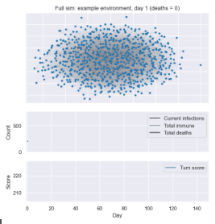
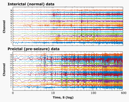

## Projects

| Project                                                                                             | Descrption                                                                                                                                                                                                                                                                                                                                                                                                                                                                                                                            | Images                                                                                                               |
|-----------------------------------------------------------------------------------------------------|---------------------------------------------------------------------------------------------------------------------------------------------------------------------------------------------------------------------------------------------------------------------------------------------------------------------------------------------------------------------------------------------------------------------------------------------------------------------------------------------------------------------------------------|----------------------------------------------------------------------------------------------------------------------|
| **[beamng-envs](https://github.com/garethjns/https://github.com/MonolithAILtd/beamng-envs)**        | Experimental car simulation enviroments (track testing, crash tesing, etc.) using [Beamng.drive/tech](https://www.beamng.com/game/) and [BeamNGpy](https://github.com/BeamNG/BeamNGpy)                                                                                                                                                                                                                                                                                                                                                |   |
| **[Matchmaking](https://github.com/garethjns/matchmaking)**                                         | Implementation and experimental evaluation of player skill rating and game matchmaking methods for multiplayer team games                                                                                                                                                                                                                                                                                                                                                                                                             |                                                                                                                      |
| **[Social distancing simulator](https://github.com/garethjns/social-distancing-sim)**               | Simulating disease spread in a graph-based model that allows agent interaction.                                                                                                                                                                                                                                                                                                                                                                                                                                                       |                                                             |
| **[Reinforcement learning using Keras](https://github.com/garethjns/reinforcement-learning-keras)** | Building various reinforcement learning approaches from scratch in Keras and Tensorflow 2.3.                                                                                                                                                                                                                                                                                                                                                                                                                                          |                                            |
| **[Epileptic Seizure prediction](https://github.com/garethjns/Kaggle-EEG)**                         | Predicting epileptic seizures in humans using machine learning and EEG data. Publications: [Brain](https://www.sciencedirect.com/science/article/pii/S0959438816300678), [Epilepsia](https://onlinelibrary.wiley.com/doi/abs/10.1111/epi.16418), [Kaggle blog](https://medium.com/kaggle-blog/seizure-prediction-competition-3rd-place-winners-interview-gareth-jones-5982b9e3956c), [Mathworks blog](https://www.mathworks.com/company/newsletters/articles/using-machine-learning-to-predict-epileptic-seizures-from-eeg-data.html) |                                                                                    |
